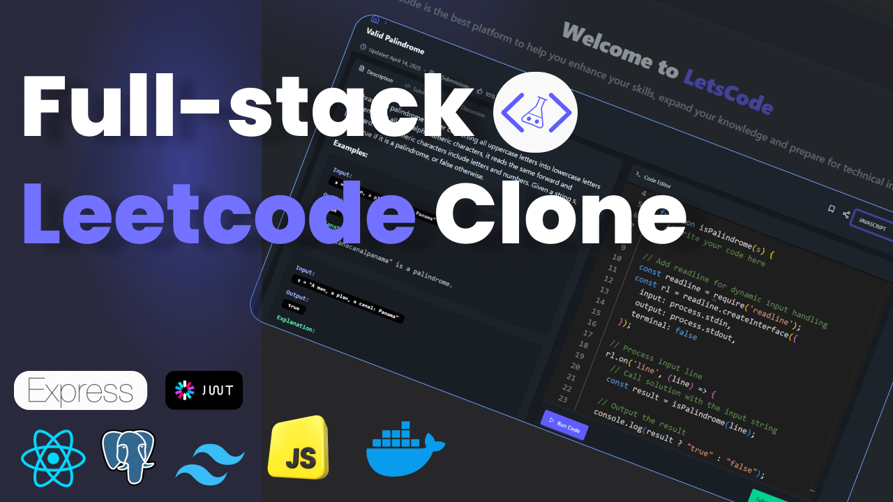

# WheyCode


WheyCode is a full-stack coding platform inspired by LeetCode. It helps users prepare for coding interviews and improve their coding skills by solving programming problems, managing playlists, and tracking submissions.

## Features

- User authentication (sign up, login, logout)
- Browse and solve coding problems
- Code editor with Monaco integration
- Run and submit code with real-time feedback
- Track submissions and view submission history
- Create and manage playlists of problems
- Admin panel for adding new problems

## Tech Stack

- **Frontend:** React, Vite, Zustand, React Router, DaisyUI, Lucide React, Axios
- **Backend:** Node.js, Express, Prisma ORM, PostgreSQL, JWT authentication
- **Other:** Monaco Editor, React Hook Form, Toast notifications

## Project Structure
backend/ ├── src/ │ ├── controllers/ │ ├── middleware/ │ ├── routes/ │ ├── libs/ │ └── generated/ ├── prisma/ │ ├── schema.prisma │ └── migrations/ ├── .env └── package.json

frontend/ ├── src/ │ ├── components/ │ ├── page/ │ ├── store/ │ ├── layout/ │ ├── libs/ │ └── assets/ ├── index.html └── package.json

## Getting Started

### Prerequisites

- Node.js (v18+ recommended)
- PostgreSQL

### Backend Setup

1. **Install dependencies:**
   ```sh
   cd backend
   npm install

2. **Configure environment variables:**
    - Copy `.env.example` to `.env` and fill in your database credentials and JWT secret.

3. **Run database migrations:**
    ```sh
    npx prisma migrate dev --name init
    ```

4. **Start the backend server:**
    ```sh
    npm run dev
    ```

### Frontend Setup

1. **Install dependencies:**
    ```sh
    cd ../frontend
    npm install
    ```

2. **Start the frontend development server:**
    ```sh
    npm run dev
    ```

The frontend will typically run on [http://localhost:5173](http://localhost:5173) and the backend on [http://localhost:3000](http://localhost:3000).

## Contributing

Contributions are welcome! Please open issues or submit pull requests for improvements and bug fixes.

## License

This project is licensed under the MIT License.